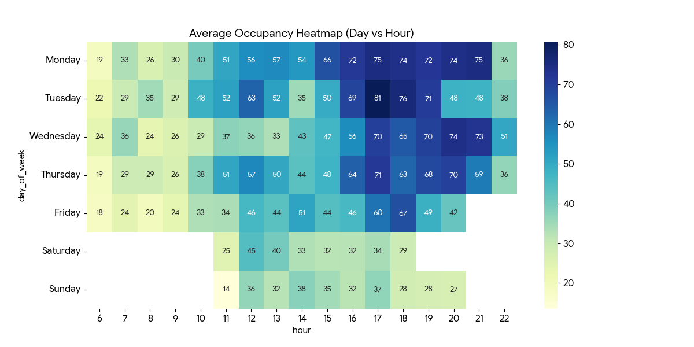
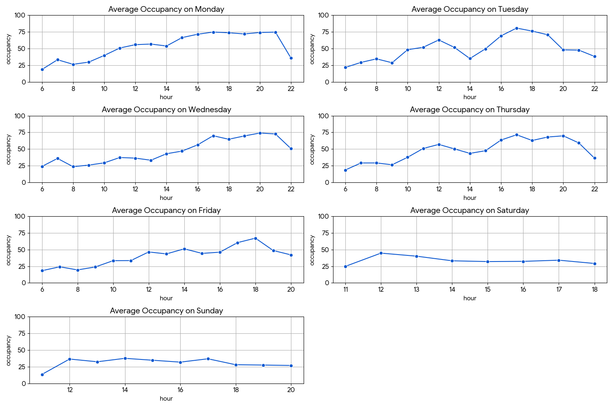
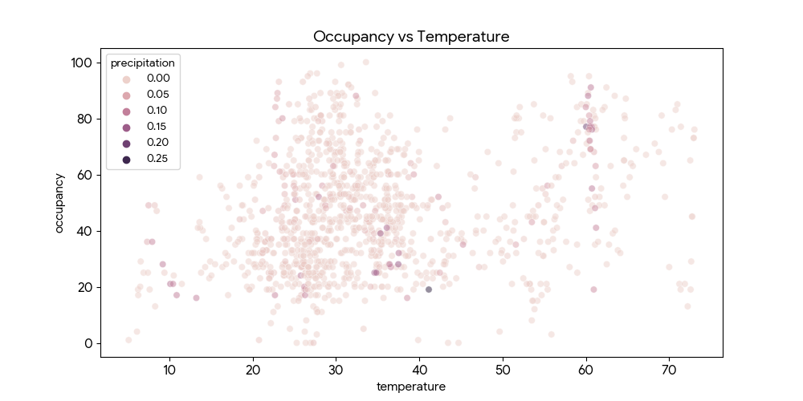

# OccupancyInsight


Automated occupancy monitoring system with exploratory data analysis for Wentworth Institute of Technology's Schumann Fitness Center — building toward ML-based occupancy prediction.



---

## Project Overview

OccupancyInsight monitors and logs real-time occupancy data alongside weather conditions at the Wentworth gym to identify attendance patterns and build predictive models. The system automatically collects data during gym operating hours and stores it in a local SQLite database. The project is now entering an exploratory analysis phase while data collection continues in parallel.

---

## Motivation

After more than a year of gym attendance, I identified a significant personal problem: the difficulty of determining when the gym would be crowded. This project transforms that observation into a practical machine learning application that can predict occupancy levels based on historical patterns and environmental factors.

---

## Current Phase: Data Collection & Analysis

🔵 **Status**: Active Data Collection + Exploratory Analysis (In Progress | 3/17/2026)

The project is currently running on two parallel tracks:

- **Ongoing Collection**: Daily logging continues throughout the spring semester and beyond
- **Exploratory Analysis**: Initial trends and patterns are being identified from the collected dataset

**Collection Parameters**
- **Collection Period**: Spring semester (excluding spring break), with continuation through end of semester and potentially beyond
- **Data Points**: Occupancy percentage, temperature, and precipitation
- **Frequency**: Every 15 minutes during gym operating hours (XX:00, XX:15, XX:30, XX:45)
- **Storage**: SQLite database for reliable data persistence

---

## Analysis

The following visualizations represent early exploratory analysis on the collected dataset. Charts are generated from occupancy, temperature, and precipitation data logged since the start of the collection period.

### Occupancy Trends by Day of Week

Hourly occupancy trends broken down across all 7 days of the week. Each subplot represents a single day, plotted in 1-hour increments, allowing for direct day-to-day comparison of traffic patterns throughout the gym's operating hours.



---

### Occupancy Heatmap

A heatmap visualization of occupancy intensity across hours of the day and days of the week. Darker cells indicate higher average occupancy, providing an at-a-glance view of the busiest and quietest windows throughout the week.


---

### Occupancy vs. Temperature vs. Precipitation

A multi-variable chart exploring the relationship between gym occupancy and environmental conditions. This visualization examines whether temperature and precipitation have a measurable influence on attendance behavior.



---

## Data Schema

All data is persisted in a local SQLite database. The table below describes the structure of each logged record.

| Column | Type | Description |
|---|---|---|
| `id` | INTEGER | Auto-incrementing primary key |
| `timestamp` | TEXT | ISO 8601 datetime of the reading (e.g. `2026-02-12 08:15:00`) |
| `facility` | TEXT | Facility identifier (Schumann Fitness Center) |
| `occupancy` | REAL | Current occupancy as a percentage of capacity |
| `temperature` | REAL | Outdoor temperature at time of reading |
| `precipitation` | REAL | Precipitation level at time of reading |

---

## Features

- **Automated Monitoring**: Runs continuously in the background during gym operating hours
- **Environmental Data Integration**: Captures temperature and precipitation data via weather API
- **Persistent Storage**: SQLite database for efficient data management and future querying
- **Minimal Overhead**: Lightweight operation with task scheduling on Windows
- **Automated Scheduling**: Batch script integration with Windows Task Scheduler for hands-off operation

---

## Technical Stack

| Layer | Technology |
|---|---|
| Primary Language | Python 3.8+ |
| Data Storage | SQLite |
| Weather Data | OpenWeatherMap API (env variable protected) |
| Automation | Windows Batch Scripting + Task Scheduler |
| Planned ML | R, TensorFlow |
| Environment | Windows |

---

## Installation & Setup

### Prerequisites

- Python 3.8 or higher
- Active internet connection (for weather API)
- OpenWeatherMap API key — available at https://openweathermap.org/api

### Configuration

1. **Clone the repository**
   ```bash
   git clone https://github.com/LandryTech/OccupancyInsight.git
   cd OccupancyInsight
   ```

2. **Install dependencies**
   ```bash
   pip install -r requirements.txt
   ```

3. **Set up environment variables**
   Create a `.env` file in the project root:
   ```
   WEATHER_API_KEY=your_api_key_here
   ```

4. **Run the logger**
   ```bash
   python gym_occupancy_logger.py
   ```
   Or use the included batch script with Windows Task Scheduler for automated scheduling:
   ```
   start_gym_logger.bat
   ```

---

## Data Collection Process

The monitoring system follows this workflow:

1. **Data Acquisition**: Retrieves current occupancy percentage from the gym's live feed
2. **Enrichment**: Fetches real-time weather metrics (temperature, precipitation) via API
3. **Logging**: Records all fields with a timestamp to the SQLite database
4. **Archival**: Stores data continuously for future analysis and model training

---

## Roadmap

### ✅ Phase 1: Data Collection (Active)
- Automated data logging during gym operating hours
- Environmental data integration via weather API
- SQLite storage and schema design

### 🔄 Phase 2: Exploratory Analysis (In Progress)
- Initial trend visualizations (occupancy by day, heatmaps, environmental correlations)
- Feature engineering and data preprocessing
- Dataset evaluation ahead of model training

### Phase 3: Model Development (Planned)
- Baseline model training and evaluation
- Model parameter tuning
- Experimentation with R-based and TensorFlow models

### Phase 4: Advanced Modeling (Planned)
- Deep learning with TensorFlow
- Ensemble methods and optimization
- Production model selection

### Phase 5: Deployment & Release (Planned)
- Release anonymized/aggregated dataset
- Publish trained models
- API development for real-time predictions
- Web interface or dashboard

---

## Learning Objectives

This project is also a personal learning vehicle for:

- Machine learning fundamentals and advanced techniques
- TensorFlow and neural network development
- Data engineering and database management
- Time series analysis and forecasting
- Real-world application development

---

## Development Notes

**Code Attribution**: Portions of this codebase were developed with assistance from Claude AI (Anthropic), with comprehensive review, testing, and customization by the project author. All code has been validated and modified to ensure functionality, reliability, and alignment with project objectives.

---

## License

MIT License — see [LICENSE](LICENSE) for details.

---

## Contact & Questions

For questions about this project, please open an issue on the GitHub repository or reach out via LinkedIn.

- **LinkedIn**: https://www.linkedin.com/in/kadenlandry/

---

**Repository**: https://github.com/LandryTech/OccupancyInsight  
**LinkedIn**: https://www.linkedin.com/in/kadenlandry/  
**Last Updated**: March 17th, 2026  
**Project Phase**: Data Collection & Exploratory Analysis
